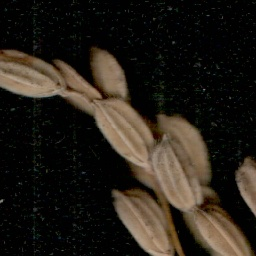
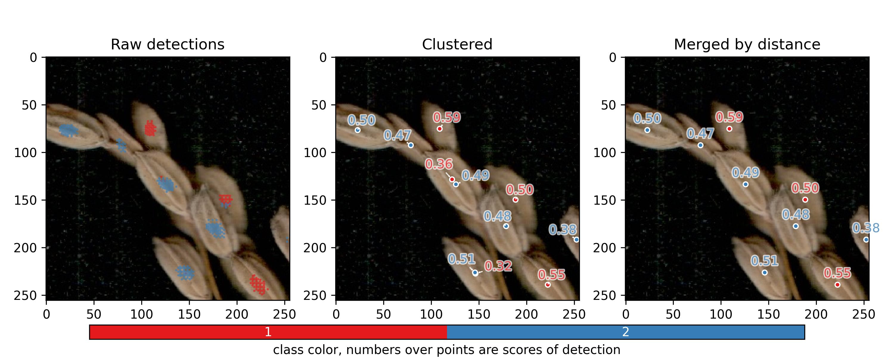
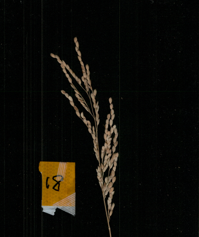
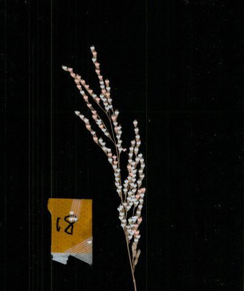

# EasyP2PNet: A Multiple-Class P2PNet Based on RGB Images

EasyP2PNet is an **easy-to-use** and **multiple class** [P2PNet](https://github.com/TencentYoutuResearch/CrowdCounting-P2PNet) modificiation.

**Features**:

* Supports **multi-class** points counting.
* Enables dataset generation from [v7labs](https://www.v7labs.com/) and [labelme](https://github.com/wkentaro/labelme).
* Provides a user-friendly API for training and inferencing.
* Ensures fast and reproducible dependency installation using [uv](https://docs.astral.sh/uv/getting-started/installation/).

**Table of Contents**

- [EasyP2PNet: A Multiple-Class P2PNet Based on RGB Images](#easyp2pnet-a-multiple-class-p2pnet-based-on-rgb-images)
  - [1. Setup Environment](#0-setup-environment)
    - [1.1 Drivers and hardward](#11-drivers-and-hardward)
    - [1.2 Virtual env and dependencies](#12-virtual-env-and-dependencies)
  - [2. Inference](#2-inference)
    - [2.1 Inference one patch image (256x256)](#21-inference-one-patch-image-256x256)
    - [2.2 Inference whole raw image](#22-inference-whole-raw-image)
    - [2.3 Python API for coding](#23-python-api-for-coding)
  - [3. Dataset](#3-dataset)
    - [3.1 Download demo datasets](#31-download-demo-datasets)
    - [3.2 Prepare your own datasets](#32-prepare-your-own-datasets)
  - [4. Training](#4-training)
  - [5. Develop notes](#5develop-notes)
  - [6. Publications](#6-publications)

Here is our related paper for dual-class grain counting: [GrainCountingP2PNet: An RGB image-based phenotyping system for assessing spikelet fertility in rice panicles (under view)]()

## 1. Setup Environment

### 1.1 Drivers and hardward

This project recommand **minimum** cuda version `12.4`, lower versions may work but have not been tested.

```bash
> nvidia-smi

Tue Jun 24 12:01:39 2025       
+-----------------------------------------------------------------------------------------+
| NVIDIA-SMI 570.144                Driver Version: 570.144        CUDA Version: 12.8     |
|-----------------------------------------+------------------------+----------------------+
```

It has been examined on **Arch-Linux** x86 machine with Nvidia RTX 4090 and cuda `12.8`; also **Windows 11** with cuda `12.9` and Nvidia RTX 3060Ti.

### 1.2 Virtual env and dependencies

To ensure reproducibility, we recommend using [uv](https://docs.astral.sh/uv/getting-started/installation/) to create and manage Python virtual environments. Please verify that the `uv` command is available in your command line:

```bash
> uv --version
uv 0.6.14
```

Using the following command to setup the virtual environment for code development:

```bash
> git clone https://github.com/UTokyo-FieldPhenomics-Lab/GrainCountingP2PNet.git
> cd ./GrainCountingP2PNet
> uv venv  # create virtual env
> uv sync  # install all dependencies
```

To use that virtual environment, you can run python scripts directly once you entered the project folder with `.venv` (refer [Running scripts | uv](https://docs.astral.sh/uv/guides/scripts/)):

```bash
> uv run xxxx.py
```

<details>

<summary>Click here to show the equal traditional way</summary>

```bash
> source .venv/bin/activate
(.venv) > python xxxx.py
```

</details>

---

To run python command, using the following command:

```bash
> uv run python
Python 3.11.12 (main, Apr  9 2025, 04:04:00) [Clang 20.1.0 ] on linux
Type "help", "copyright", "credits" or "license" for more information.
>>> 
```

<details>

<summary>Click here to show the equal traditional way</summary>

```bash
> source .venv/bin/activate
(.venv) > python
Python 3.11.12 (main, Apr  9 2025, 04:04:00) [Clang 20.1.0 ] on linux
Type "help", "copyright", "credits" or "license" for more information.
>>> 
```

</details>


## 2. Inference 

As a quick testing for this model, please download pretrained model `demo_best_mae.pth` and demo image for from [releases](https://github.com/UTokyo-FieldPhenomics-Lab/GrainCountingP2PNet/releases/tag/v0.0.3). 

After downloading putting it to the root of this github repo and using the `uv run -m gcp2pnet.inference --args` command to execute the inference, the detailed arguments help is listed here or checked by `uv run -m gcp2pnet.inference --help`:

**Arguments for inference:**

*Note: bold arguments are required parameters.*

| Argument              | Default Value | Type  | Description |
|-----------------------|---------------|-------|-------------|
| **`--img_path`**      | Required      | str   | The path to image |
| **`--weight_path`**   | Required      | str   | resume from checkpoint |
| `--result_folder`     | None          | str   | The folder to save results on raw image |
| `--patch_result_folder` | None       | str   | The folder to save intermediate results on each patch image |
| `--seed`              | 42            | int   | Global random seed |
| `--threshold`         | 0.3           | float | threshold to heatmap |
| `--merge_distance`    | 25            | int   | the pixel distance to merge points during intermediate processing |
| `--sliding_window`    | False         | bool  | Whether crop high-resolution images to small patches for inference |
| `--window_size`       | 256           | int   | The size of sliding window, default 256x256 |
| `--overlap_ratio`     | 0.2           | float | Overlap ratio between patches |
| `--row`               | 2             | int   | row number of anchor points |
| `--line`              | 2             | int   | line number of anchor points |
| `--num_workers`       | 1             | int   | number of workers |
| `--gpu_id`            | 0             | int   | the gpu used for training |
| `--device`            | device        | str   | the torch running device, 'cpu' or 'cuda' |

### 2.1 Inference one patch image (256x256)

The official demo model is trained by 256x256 patch images, you can directly inference the sliced patch by:

```bash
> uv run -m gcp2pnet.inference \
    --img_path "./data/20220207_17_Y_a_v03_h02.JPG" \
    --weight_path "./demo_best_mae.pth" \
    --result_folder "./data/" \
    --patch_result_folder "./data/" \
```

It will gives the following DataFrame outputs in console:

```
            x           y     score cls
0  108.878756   75.222892  0.588416   1
1  188.493221  149.772534  0.499952   1
2  222.360333  239.170328  0.554243   1
3   22.765125   76.594569  0.504329   2
4   78.569320   92.489747  0.474745   2
5  125.916349  133.613068  0.492151   2
6  178.559971  177.599326  0.482725   2
7  252.538132  191.777252  0.382432   2
8  145.957041  226.342230  0.508119   2
```

And results preview image. If `--result_folder` is not specified, instead of saving result images, it will pop up a window to preview the results.

| Original Image | Result Image |
|------------------------|----------------------|
|  |  |

if you specify `--patch_result_folder` parameter, it will also save the intermediate results of each patch:



### 2.2 Inference whole raw image 

For most of the case, we want to inference directly on raw images with much larger size than model training size. In this case, to ensure better performance, we need to slice the raw image into several small sliding windows (256x256) and then merge the results. 

To do this, you first need to specify `--sliding_window` to `True`, then specify other optional parameters to control the sliding window and merging process.

Take our image as example:

```bash
> uv run -m gcp2pnet.inference \
    --img_path "data/20220207_18_G_a.JPG" \
    --weight_path "demo_best_mae.pth" \
    --result_folder "data/" \
    --sliding_window True \
    --window_size 768 \
    --patch_result_folder "data/patch/" \
    --threshold 0.5 \
    --overlap_ratio 0.2 \
    --merge_distance 75
```

Please notice: for `--window_size`, we specify **3 times** (256\*3=768) larger than model training size (256x256) to accelerate the inference process. In corresponding, the default `--merge_distance` is also tribled from 25 to 25\***3=75**.

Here is the result (shrinked image size for faster webview, the source file is 14.5 MB):

| Original Image | Result Image |
|------------------------|----------------------|
|  |  |

Even though forget the argument `--sliding_window`, the API will also compare the input image size with model size, if exceeds the model size, it will ask you to choose whether use sliding window or not:

```bash
[Warning] The input image size (7728, 9228) exceeds model training size (256, 256).
          This may cause misdetection for small objects.
          Continue inferencing by default resizing [Y] or using slidling window [N]? (Y/N)
```

But recommend specify `--sliding_window` related arguements first, the provious warning force to use default arguements for sliding window.

### 2.3 Python API for coding

If you want to coding by yourself in python (e.g. for batch processing), you can use the following python API:

```python
from pathlib import Path
import gcp2pnet

args = gcp2pnet.inference.get_inf_arguments()
args.weight_path = Path("./demo_best_mae.pth")
args.img_path = Path("./data/20220207_18_G_a.JPG")
args.result_folder = Path("data/")
args.sliding_window = True
args.window_size = 256 * 3
args.overlap_ratio = 0.2
args.merge_distance = 25 * 3
args.patch_result_folder = Path("data/patch/")
args.threshold = 0.5

result_df = gcp2pnet.inference.main(args)
```

If you want further control the details, please refer the source code of `gcp2pnet.inference.main()` to get full control of outputs.

## 3. Dataset

### 3.1 Download demo datasets

The organized demo dataset for training is available at [release/demo_dataset.zip](https://github.com/UTokyo-FieldPhenomics-Lab/GrainCountingP2PNet/releases/tag/v0.0.1)

Please download and unzip contents into `data/demo_dataset/` with the following yolo-like structures:

```
data/demo_dataset/
|-- images/
|   |-- train/
|   |   |-- aaa.jpg
|   |   |-- bbb.jpg
|   |   |-- ...
|   |-- valid/
|-- labels/
|   |-- train/
|   |   |-- aaa.txt
|   |   |-- bbb.txt
|   |   |-- ...
|   |-- valid/
|-- classes.json
```

This dataset has already been converted and prepared for training directly.


### 3.2 Prepare your own datasets

To build your own dataset, you firstly need split your raw images to the following folder structure:

```plaintxt
data/demo_raw
|-- train_images
|   |-- aaa.jpg
|   |-- bbb.jpg
|   |-- ...
|-- train_labels
|   |-- aaa.json
|   |-- bbb.json
|   |-- ...
|-- valid_images
|-- valid_labels
|-- test_images (optional)
|-- test_labels (optional)
```

This package currently support the json annotation file generated by [v7labs](https://www.v7labs.com/) and [labelme](https://github.com/wkentaro/labelme). Please generate a multi-class annotation like the following demo (just for illustration not the actual data):


You also need to prepare a json file to record the class label with unique integer id (start from **1**, allow **multiple labels share the same integer id**):

**classes.json**:

```json
{
    "Fill": 1, 
    "平べったいけど沈む": 1, 
    "平べったくて浮く": 2, 
    "詰まっているけど浮く": 2, 
    "Unfill": 2
}
```

You can check the demo raw data as examples at [release/demo_raw.zip](https://github.com/UTokyo-FieldPhenomics-Lab/GrainCountingP2PNet/releases/tag/v0.0.3)

Please unzip to `data/demo_raw` folder and then execute the following command:

```bash
> uv run -m gcp2pnet.datasets \
    --anno_tool v7labs \
    --dataset_folder "data/demo_dataset" \
    --train_image_folder "data/demo_raw/training_images" \
    --train_label_folder "data/demo_raw/training_labels" \
    --valid_image_folder "data/demo_raw/evaluation_images" \
    --valid_label_folder "data/demo_raw/evaluation_labels" \
    --classes_json "data/demo_raw/classes.json" \
    --patch_size 768 \
    --overlap_ratio 0.0 \
    --patch_save_size 256
```

It will convert the raw images and labels to standard `data/demo_dataset` folder for training. 

The details about arguements can be checked by `uv run -m gcp2pnet.datasets --help`:

| Argument                  | Default Value | Type   | Description |
|---------------------------|---------------|--------|-------------|
| **`--dataset_folder`**    | Required      | str    | The dataset root folder for receiving converted outputs |
| **`--train_image_folder`** | Required    | str    | The folder contains images for generating training data |
| **`--train_label_folder`** | Required    | str    | The folder contains labels for generating training data |
| **`--valid_image_folder`** | Required    | str    | The folder contains images for generating validation data |
| **`--valid_label_folder`** | Required    | str    | The folder contains labels for generating validation data |
| **`--classes_json`**     | Required      | str    | The classes.json file record id-class pairs |
| `--anno_tool`             | "v7labs"      | str    | The tool used to annotation points and json files (choices: ["v7labs", "labelme"]) |
| `--test_image_folder`     | None          | str    | The folder contains images for generating testing data |
| `--test_label_folder`     | None          | str    | The folder contains labels for generating testing data |
| `--patch_size`            | 768 (256*3)   | int    | The patch size in pixels on raw images |
| `--overlap_ratio`         | 0.0           | float  | The buffer area width/patch width inside the patch (0.0 = no overlap) |
| `--patch_save_size`       | None          | int    | The saved patch image size (default: same as patch size) |

*Note: bold arguments are required parameters.*

> [!NOTE]  
> The previous API should work for most of the application case. However, to achieve better performance in the paper, we used the variate patch size. Because the raw images in the demo_dataset is collected by two apporaches with variate resolution (one width 2576 px, the other width is 7728 px), so we used the `data/demo_raw/convert2dataset.py` script to finish the conversion with variable patch size (256px and 768px, respectively).

The sliced image patch has the file name format: `originame_x{...}_y{...}_s{...}.jpg`, `(x, y)` are the top left corner of patch on raw image, the `s` is the original patch size on raw image.

The converted label txt file has the following format: `class x.pix y.pix`, for example:

**originame_x{...}_y{...}_s{...}.txt**:

```plaintxt
2 110.66666666666666 206.66666666666666
2 228.66666666666666 2.6666666666666665
1 135.0 228.0
1 179.0 170.0
1 199.66666666666666 99.66666666666666
1 240.0 44.666666666666664
```


## 4. Training 

```bash
> uv run -m gcp2pnet.train \
    --dataset_folder ./data/demo_dataset \
    --batch_size 8 \
    --epochs 100 \
    --run_name demo_train \
    ...
```

For RTX 4090 with 24GB memory, the `batch_size` can be set up to 64.

**Detailed Parameters:**

| Argument                  | Default Value | Type   | Description |
|---------------------------|---------------|--------|-------------|
| **`--dataset_folder`**    | Required      | str | Path to dataset |
| **`--batch_size`**        | 1             | int    | Batch size |
| **`--epochs`**            | 100           | int    | Number of training epochs |
| **`--output_dir`**        | './runs'      | str    | Output folder for checkpoints/logs |
| **`--run_name`**          | 'p2pnet'      | str    | Name for the run |
| `--resume`                | ''            | str    | Path to checkpoint to resume from |
| `--start_epoch`           | 0             | int    | Starting epoch |
| `--eval_freq`             | 5             | int    | Evaluation frequency (in epochs) |
| `--lr`                    | 1e-3          | float  | Learning rate for background model |
| `--lr_fpn`                | 1e-4          | float  | Learning rate for detection head |
| `--weight_decay`          | 1e-4          | float  | Weight decay |
| `--lr_drop`               | 2000000       | int    | Step for learning rate drop |
| `--clip_max_norm`         | 0.1           | float  | Gradient clipping max norm |
| `--frozen_weights`        | None          | str    | Path to pretrained model (only trains mask head if set) |
| `--set_cost_class`        | 0.5           | float  | Class coefficient in matching cost (Hungarian strategy) |
| `--set_cost_point`        | 0.5           | float  | L1 point coefficient in matching cost |
| `--point_loss_coef`       | 0.02          | float  | Point loss coefficient |
| `--eos_coef`             | 0.01          | float  | Relative classification weight of no-object class |
| `--threshold`             | 0.5           | float  | Threshold for evaluation (evaluate_crowd_no_overlap) |
| `--row`                   | 2             | int    | Row number of anchor points |
| `--line`                  | 2             | int    | Line number of anchor points |
| `--seed`                 | 42            | int    | Random seed |
| `--eval`                 | False         | bool   | Whether to run evaluation |
| `--num_workers`          | 1             | int    | Number of data loading workers |
| `--gpu_id`               | 0             | int    | GPU ID for training |

---

If you want to coding by yourself in python, you can use the following python API:

```python
from pathlib import Path
import gcp2pnet

args = gcp2pnet.train.get_train_arguments()
args.dataset_folder = Path("./data/demo_dataset")
args.batch_size = 8
args.epochs = 100
args.run_name = "demo_train"
args.seed = 42

gcp2pnet.train.main(args)
```

If you want further control the details, please refer the source code of `gcp2pnet.train.main()` to get full control of outputs.

---

After training, using the following command to check the results figure by tensorboard:

```bash
> uv run tensorboard \
    --logdir ./runs/<run_name>/tensorboard_logs \
    --port 8123

Serving TensorBoard on localhost; to expose to the network, use a proxy or pass --bind_all
TensorBoard 2.19.0 at http://localhost:8123/ (Press CTRL+C to quit)
```

Then press `ctrl` + left click to open the `localhost:8123` to check in browser.


## 5. Develop notes

### 5.1 `num_classes` for multiple classes

<details>

<summary>Click to show details</summary>

For the original P2PNet, it is only one class (human head) detection, in its code, it using `num_classes=1` to treats persons as a single class: [models/p2pnet.py: def build()](https://github.com/TencentYoutuResearch/CrowdCounting-P2PNet/blob/5c91a81ca062b1c7fd3db3ad1c55b1c21f0a7455/models/p2pnet.py#L326-L340)

```python
def build(args, training):
    # treats persons as a single class
    num_classes = 1
    ...
    weight_dict = {'loss_ce': 1, 'loss_points': args.point_loss_coef}
    losses = ['labels', 'points']
    matcher = build_matcher_crowd(args)
    criterion = SetCriterion_Crowd(num_classes, \
                                matcher=matcher, weight_dict=weight_dict, \
                                eos_coef=args.eos_coef, losses=losses)

```

Also, the `loss_ce` also equals to `num_classes`.

But inside P2PNet, it has two classes: `{0: 'background', 1: 'person'}`, `self.num_classes` then changed to `2`: [models/p2pnet.py: class P2PNet()](https://github.com/TencentYoutuResearch/CrowdCounting-P2PNet/blob/5c91a81ca062b1c7fd3db3ad1c55b1c21f0a7455/models/p2pnet.py#L194-L207)

```python
# the defenition of the P2PNet model
class P2PNet(nn.Module):
    def __init__(self, backbone, row=2, line=2):
        super().__init__()
        self.backbone = backbone
        self.num_classes = 2
        ...
        self.classification = ClassificationModel(num_features_in=256, \
                                            num_classes=self.num_classes, \
                                            num_anchor_points=num_anchor_points)
```

For the `SetCriterion_crowd` class function, it also used `num_class+1` inside, [models/p2pnet.py: class SetCriterion_crowd().\_\_init\_\_()](https://github.com/TencentYoutuResearch/CrowdCounting-P2PNet/blob/5c91a81ca062b1c7fd3db3ad1c55b1c21f0a7455/models/p2pnet.py#L231-L248)

```python
class SetCriterion_Crowd(nn.Module):
    def __init__(self, num_classes, matcher, weight_dict, eos_coef, losses):
        super().__init__()
        self.num_classes = num_classes
        ...
        empty_weight = torch.ones(self.num_classes + 1)
        ...
```

---

Thus, for multiple class modification, we modified pass `num_classes=2` to `P2PNet.num_classes`. But adding 1 inside the networks. In actual, the model has `[0, 1, 2]` three classes.

```python
# gcp2pnet/models/p2pnet.py
def build_model(args, num_classes, training=False):
    # >>> num_classes = 2
    model = P2PNet(args.row, args.line, num_classes=num_classes)
    ...
    weight_dict = {'loss_ce': num_classes, 'loss_points': args.point_loss_coef}
    ...
    criterion = SetCriterion_Crowd(num_classes, # >>> num_classes = 2
    ...

class P2PNet(nn.Module):
    def __init__(self, row=2, line=2, num_classes=2):
        super().__init__()
        self.num_classes = num_classes  # >>> num_classes=2
        ...
        self.classification = ClassificationModel(num_features_in=8,
            num_classes=self.num_classes + 1, # >>> 2+1 as [0, 1, 2] three classes
            num_anchor_points=num_anchor_points)

class SetCriterion_Crowd(nn.Module):

    def __init__(self, num_classes, matcher, weight_dict, eos_coef, losses):
        super().__init__()
        self.num_classes = num_classes # >>> 2
        ...
        # e.g. input class [1, 2] -> 
        # but need background id=0
        # => num_class = num_class + 1
        empty_weight = torch.ones(self.num_classes + 1)   # >>> 2+1 as [0, 1, 2] three classes
        empty_weight[0] = self.eos_coef
        self.register_buffer('empty_weight', empty_weight)

# gcp2pnet/inference.py
def apply_model(model, img_tensor, threshold):
    # run inference
    outputs = model(img_tensor)

    outputs_points = outputs['pred_points'][0]
    outputs_scores = torch.nn.functional.softmax(outputs['pred_logits'], -1)

    raw_results = {}
    # in our case, model.num_classes = 2, this aims to iter [1, 2]
    for class_i in range(1, model.num_classes + 1):  # >>> 2+1 as [0, 1, 2] three classes
        outputs_score = outputs_scores[:, :, class_i][0]

        points = outputs_points[outputs_score > threshold].detach().cpu().numpy()#.tolist()
        scores = outputs_score [outputs_score > threshold].detach().cpu().numpy()#.tolist()

        raw_results[class_i] = {'points': points, 'scores': scores}

    return raw_results
```


</details>

## 6. Publications

Please cite our paper if this project helps you:

```bib
Under review
```
