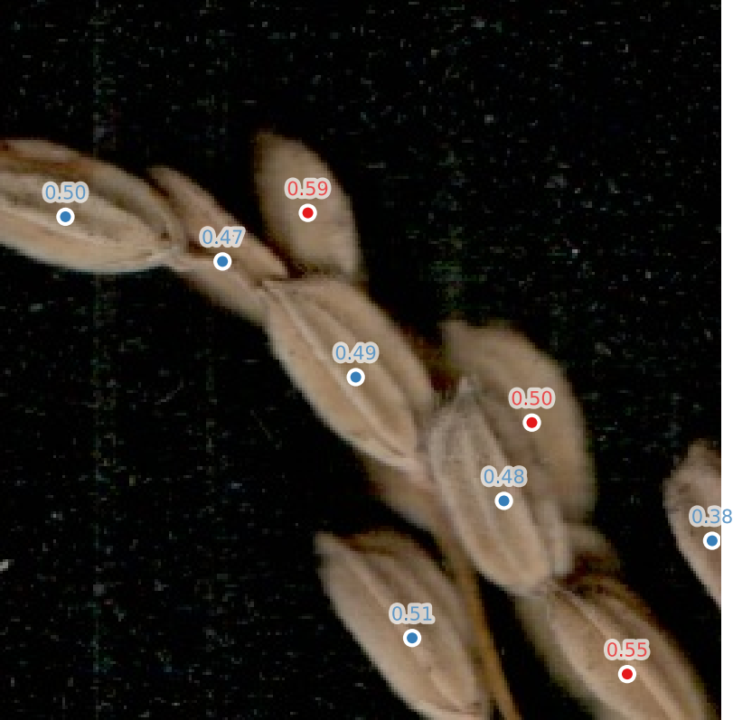
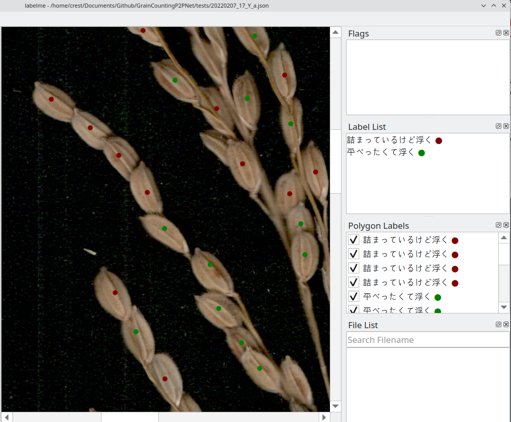
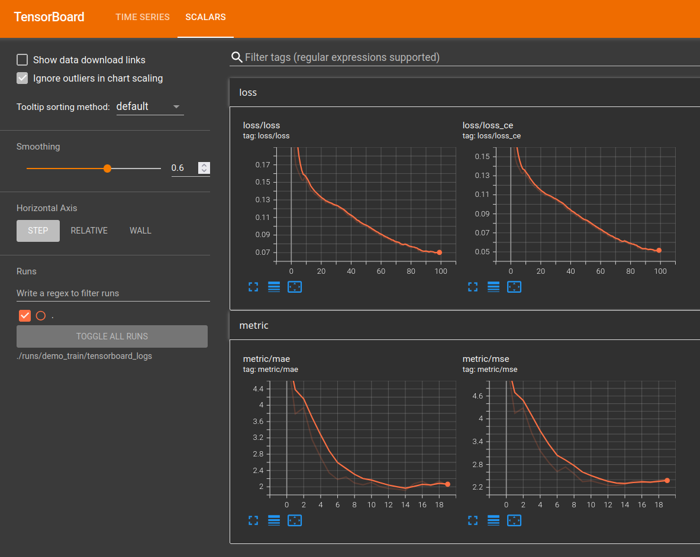

# EasyP2PNet: A Multiple-Class P2PNet Based on RGB Images

EasyP2PNet is an **easy-to-use** and **multiple class** [P2PNet](https://github.com/TencentYoutuResearch/CrowdCounting-P2PNet) modificiation.

**Features**:

* Supports **multi-class** points counting.
* Enables dataset generation from [v7labs](https://www.v7labs.com/) and [labelme](https://github.com/wkentaro/labelme).
* Provides a user-friendly API for training and inferencing.
* Ensures fast and reproducible dependency installation using [uv](https://docs.astral.sh/uv/getting-started/installation/).

Here is our related paper for dual-class grain counting: [GrainCountingP2PNet: An RGB image-based phenotyping system for assessing spikelet fertility in rice panicles (under view)]()

## 0. Setup Environment

### Drivers and hardward

This project recommand **minimum** cuda version `12.4`, lower versions may work but have not been tested.

```bash
> nvidia-smi

Tue Jun 24 12:01:39 2025       
+-----------------------------------------------------------------------------------------+
| NVIDIA-SMI 570.144                Driver Version: 570.144        CUDA Version: 12.8     |
|-----------------------------------------+------------------------+----------------------+
```

It has been examined on **Arch-Linux** x86 machine with Nvidia RTX 4090 and cuda `12.8`; also **Windows 11** with cuda `12.9` and Nvidia RTX 3060Ti.

### Virtual env and dependencies

To ensure reproducibility, we recommend using [uv](https://docs.astral.sh/uv/getting-started/installation/) to create and manage Python virtual environments. Please verify that the `uv` command is available in your command line:

```bash
> uv --version
uv 0.6.14
```

Using the following command to setup the virtual environment for code development:

```bash
> git clone https://github.com/UTokyo-FieldPhenomics-Lab/GrainCountingP2PNet.git
> cd ./GrainCountingP2PNet
> uv venv  # create virtual env
> uv sync  # install all dependencies
```

To use that virtual environment, you can run python scripts directly once you entered the project folder with `.venv` (refer [Running scripts | uv](https://docs.astral.sh/uv/guides/scripts/)):

```bash
> uv run xxxx.py
```

<details>

<summary>Click here to show the equal traditional way</summary>

```bash
> source .venv/bin/activate
(.venv) > python xxxx.py
```

</details>

---

To run python command, using the following command:

```bash
> uv run python
Python 3.11.12 (main, Apr  9 2025, 04:04:00) [Clang 20.1.0 ] on linux
Type "help", "copyright", "credits" or "license" for more information.
>>> 
```

<details>

<summary>Click here to show the equal traditional way</summary>

```bash
> source .venv/bin/activate
(.venv) > python
Python 3.11.12 (main, Apr  9 2025, 04:04:00) [Clang 20.1.0 ] on linux
Type "help", "copyright", "credits" or "license" for more information.
>>> 
```

</details>


## 1. Inference 

As a quick testing for this model, please download pretrained model `demo_best_mae.pth` and demo image for from [releases](https://github.com/UTokyo-FieldPhenomics-Lab/GrainCountingP2PNet/releases/tag/v0.0.1). 

After downloading putting it to the root of this github repo and using the following command to execute the inference:

```bash
> uv run -m gcp2pnet.inference \
    --img_path "path/to/demo_image.jpg" \
    --weight_path "demo_best_mae.pth"
```

It will pop up a window to the results, to save result images directly to folder, please use `--result_path`:

```bash
> uv run -m gcp2pnet.inference \
    --img_path "./data/20220207_17_Y_a_v03_h02.JPG"\
    --weight_path "demo_best_mae.pth" \
    --result_path "./data/20220207_17_Y_a_v03_h02_results.png"
```

It will print the DataFrame results in console and result image:

```
             x           y     score cls
0    17.917275   73.201589  0.651996   1
1   110.389812   78.006449  0.751744   1
4   143.182544  177.582699  0.670365   1
5   224.996984  242.175739  0.670584   1
6    75.902485   91.724290  0.612998   2
8   129.165154  136.832257  0.591995   2
9   190.516909  151.484091  0.590699   2
10  176.682974  179.405544  0.666000   2
11  145.889114  227.981217  0.646891   2
```



---

Or if you want to coding by yourself in python (e.g. for batch processing):

```python
import gcp2pnet

args = gcp2pnet.inference.get_inf_arguments()

args.weight_path = "./demo_best_mae.pth"
args.img_path = "./data/20220207_17_Y_a_v03_h02.JPG"
args.result_path = "./data/20220207_17_Y_a_v03_h02_results.png"

# start inferencing
model = gcp2pnet.inference.load_model(args)
img_numpy, img_tensor = gcp2pnet.inference.load_image_to_tensor(args.img_path, args.device)
raw_results = gcp2pnet.inference.apply_model(model, img_tensor, args.threshold)
clustered_df  = gcp2pnet.inference.postprocess_point_clusters(raw_results)
# the final processed results in DataFrame
merged_df = gcp2pnet.inference.postprocess_merge_by_distance(results_df, prox_distance=25)

# draw results
gcp2pnet.inference.draw_result_figures(
    img_numpy, raw_results, clustered_df, merged_df,
    show=False, save_path=args.result_path)
```

## 2. Dataset

### Download demo datasets

The organized demo dataset for training is available at [release/demo_dataset.zip](https://github.com/UTokyo-FieldPhenomics-Lab/GrainCountingP2PNet/releases/tag/v0.0.1)

Please download and unzip contents into `data/demo_dataset/` with the following yolo-like structures:

```
data/demo_dataset/
|-- images/
|   |-- train/
|   |   |-- aaa.jpg
|   |   |-- bbb.jpg
|   |   |-- ...
|   |-- valid/
|-- labels/
|   |-- train/
|   |   |-- aaa.txt
|   |   |-- bbb.txt
|   |   |-- ...
|   |-- valid/
|-- classes.json
```

This dataset has already been converted and prepared for training directly.


### Prepare your own datasets

<details>

<summary>Click to show details</summary>

To build your own dataset, you firstly need split your raw images to the following folder structure:

```plaintxt
data/demo_raw
|-- train_images
|   |-- aaa.jpg
|   |-- bbb.jpg
|   |-- ...
|-- train_labels
|   |-- aaa.json
|   |-- bbb.json
|   |-- ...
|-- valid_images
|-- valid_labels
|-- test_images (optional)
|-- test_labels (optional)
```

This package currently support the json annotation file generated by [v7labs](https://www.v7labs.com/) and [labelme](https://github.com/wkentaro/labelme). Please generate a multi-class annotation like the following demo (just for illustration not the actual data):



You also need to prepare a json file to record the class label with unique integer id (start from **1**, allow **multiple labels share the same integer id**):

**classes.json**:

```json
{
    "Fill": 1, 
    "平べったいけど沈む": 1, 
    "平べったくて浮く": 2, 
    "詰まっているけど浮く": 2, 
    "Unfill": 2
}
```

You can check the demo raw data as examples at [release/demo_raw.zip](https://github.com/UTokyo-FieldPhenomics-Lab/GrainCountingP2PNet/releases/tag/v0.0.1)

Please unzip to `data/demo_raw` folder and then execute the following command:

```bash
> uv run -m gcp2pnet.datasets \
    --anno_tool v7labs \
    --dataset_folder "data/demo_dataset" \
    --train_image_folder "data/demo_raw/training_images" \
    --train_label_folder "data/demo_raw/training_labels" \
    --valid_image_folder "data/demo_raw/evaluation_images" \
    --valid_label_folder "data/demo_raw/evaluation_labels" \
    --classes_json "data/demo_raw/classes.json" \
    --patch_size 768 \
    --overlap_ratio 0.0 \
    --patch_save_size 256
```

It will convert the raw images and labels to standard `data/demo_dataset` folder for training. 

> [!NOTE]  
> The previous API should work for most of the application case. However, to achieve better performance in the paper, we used the variate patch size. Because the raw images in the demo_dataset is collected by two apporaches with variate resolution (one width 2576 px, the other width is 7728 px), so we used the `convert2dataset.py` script to finish the conversion with variable patch size (256px and 768px, respectively).

The sliced image patch has the file name format: `originame_x{...}_y{...}_s{...}.jpg`, `(x, y)` are the top left corner of patch on raw image, the `s` is the original patch size on raw image.

The converted label txt file has the following format: `class x.pix y.pix`, for example:

**originame_x{...}_y{...}_s{...}.txt**:

```plaintxt
2 110.66666666666666 206.66666666666666
2 228.66666666666666 2.6666666666666665
1 135.0 228.0
1 179.0 170.0
1 199.66666666666666 99.66666666666666
1 240.0 44.666666666666664
```

</details>


## 3. Training 

```bash
> uv run -m gcp2pnet.train \
    --dataset_folder ./data/demo_dataset \
    --batch_size 8 \
    --epochs 100 \
    --run_name demo_train \
    ...
```

For RTX 4090 with 24GB memory, the `batch_size` can be set up to 64.

After training, using the following command to check the results figure by tensorboard:

```bash
> uv run tensorboard \
    --logdir ./runs/<run_name>/tensorboard_logs \
    --port 8123

Serving TensorBoard on localhost; to expose to the network, use a proxy or pass --bind_all
TensorBoard 2.19.0 at http://localhost:8123/ (Press CTRL+C to quit)
```

Then press `ctrl` + left click to open the `localhost:8123` to check in browser.



## 4.Develop notes

### 1) `num_classes` for multiple classes

<details>

<summary>Click to show details</summary>

For the original P2PNet, it is only one class (human head) detection, in its code, it using `num_classes=1` to treats persons as a single class: [models/p2pnet.py: def build()](https://github.com/TencentYoutuResearch/CrowdCounting-P2PNet/blob/5c91a81ca062b1c7fd3db3ad1c55b1c21f0a7455/models/p2pnet.py#L326-L340)

```python
def build(args, training):
    # treats persons as a single class
    num_classes = 1
    ...
    weight_dict = {'loss_ce': 1, 'loss_points': args.point_loss_coef}
    losses = ['labels', 'points']
    matcher = build_matcher_crowd(args)
    criterion = SetCriterion_Crowd(num_classes, \
                                matcher=matcher, weight_dict=weight_dict, \
                                eos_coef=args.eos_coef, losses=losses)

```

Also, the `loss_ce` also equals to `num_classes`.

But inside P2PNet, it has two classes: `{0: 'background', 1: 'person'}`, `self.num_classes` then changed to `2`: [models/p2pnet.py: class P2PNet()](https://github.com/TencentYoutuResearch/CrowdCounting-P2PNet/blob/5c91a81ca062b1c7fd3db3ad1c55b1c21f0a7455/models/p2pnet.py#L194-L207)

```python
# the defenition of the P2PNet model
class P2PNet(nn.Module):
    def __init__(self, backbone, row=2, line=2):
        super().__init__()
        self.backbone = backbone
        self.num_classes = 2
        ...
        self.classification = ClassificationModel(num_features_in=256, \
                                            num_classes=self.num_classes, \
                                            num_anchor_points=num_anchor_points)
```

For the `SetCriterion_crowd` class function, it also used `num_class+1` inside, [models/p2pnet.py: class SetCriterion_crowd().\_\_init\_\_()](https://github.com/TencentYoutuResearch/CrowdCounting-P2PNet/blob/5c91a81ca062b1c7fd3db3ad1c55b1c21f0a7455/models/p2pnet.py#L231-L248)

```python
class SetCriterion_Crowd(nn.Module):
    def __init__(self, num_classes, matcher, weight_dict, eos_coef, losses):
        super().__init__()
        self.num_classes = num_classes
        ...
        empty_weight = torch.ones(self.num_classes + 1)
        ...
```

---

Thus, for multiple class modification, we modified pass `num_classes=2` to `P2PNet.num_classes`. But adding 1 inside the networks. In actual, the model has `[0, 1, 2]` three classes.

```python
# gcp2pnet/models/p2pnet.py
def build_model(args, num_classes, training=False):
    # >>> num_classes = 2
    model = P2PNet(args.row, args.line, num_classes=num_classes)
    ...
    weight_dict = {'loss_ce': num_classes, 'loss_points': args.point_loss_coef}
    ...
    criterion = SetCriterion_Crowd(num_classes, # >>> num_classes = 2
    ...

class P2PNet(nn.Module):
    def __init__(self, row=2, line=2, num_classes=2):
        super().__init__()
        self.num_classes = num_classes  # >>> num_classes=2
        ...
        self.classification = ClassificationModel(num_features_in=8,
            num_classes=self.num_classes + 1, # >>> 2+1 as [0, 1, 2] three classes
            num_anchor_points=num_anchor_points)

class SetCriterion_Crowd(nn.Module):

    def __init__(self, num_classes, matcher, weight_dict, eos_coef, losses):
        super().__init__()
        self.num_classes = num_classes # >>> 2
        ...
        # e.g. input class [1, 2] -> 
        # but need background id=0
        # => num_class = num_class + 1
        empty_weight = torch.ones(self.num_classes + 1)   # >>> 2+1 as [0, 1, 2] three classes
        empty_weight[0] = self.eos_coef
        self.register_buffer('empty_weight', empty_weight)

# gcp2pnet/inference.py
def apply_model(model, img_tensor, threshold):
    # run inference
    outputs = model(img_tensor)

    outputs_points = outputs['pred_points'][0]
    outputs_scores = torch.nn.functional.softmax(outputs['pred_logits'], -1)

    raw_results = {}
    # in our case, model.num_classes = 2, this aims to iter [1, 2]
    for class_i in range(1, model.num_classes + 1):  # >>> 2+1 as [0, 1, 2] three classes
        outputs_score = outputs_scores[:, :, class_i][0]

        points = outputs_points[outputs_score > threshold].detach().cpu().numpy()#.tolist()
        scores = outputs_score [outputs_score > threshold].detach().cpu().numpy()#.tolist()

        raw_results[class_i] = {'points': points, 'scores': scores}

    return raw_results
```


</details>

## 5. Publications

Please cite our paper if this project helps you:

```bib
Under review
```
